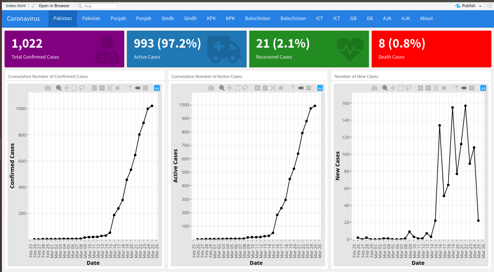
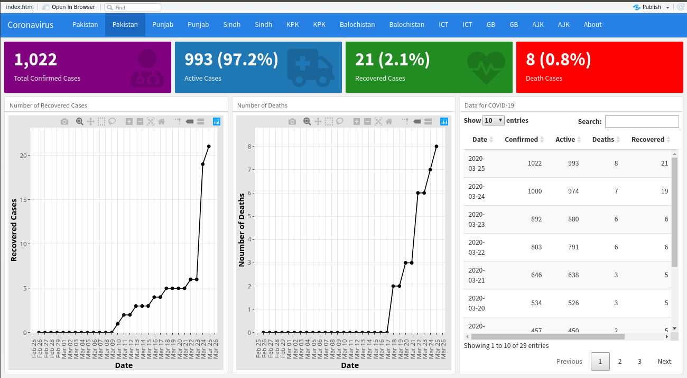

<!-- README.md is generated from README.Rmd. Please edit that file -->

```{r, include = FALSE}
knitr::opts_chunk$set(
  collapse = TRUE,
  comment = "#>"
)
```

### The Pakistan Coronavirus Dashboard
&nbsp;


This [dashboard](https://myaseen208.github.io/PakCoronaDashboard/) provides an overview of the 2019 Novel Coronavirus COVID-19 (2019-nCoV) epidemic in Pakistan. 

&nbsp;
&nbsp;
&nbsp;
&nbsp;




&nbsp;
&nbsp;

